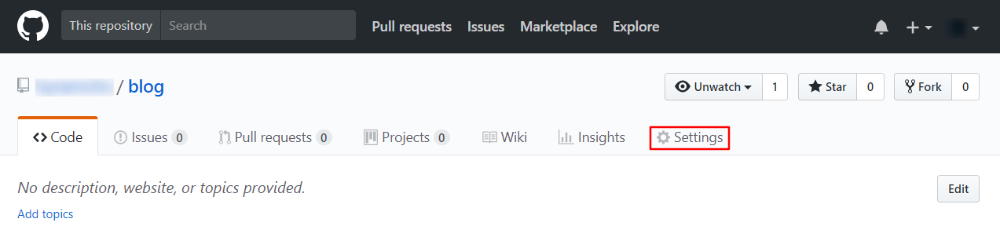
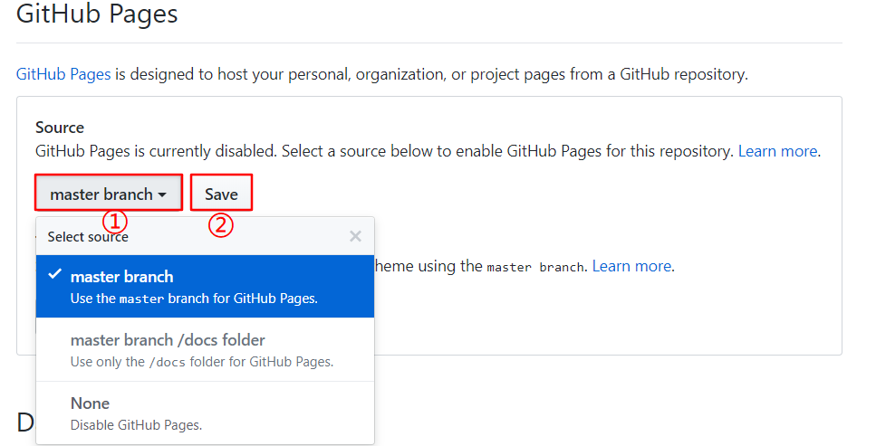
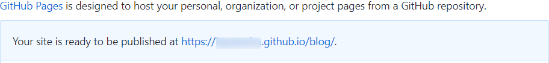
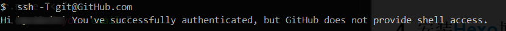
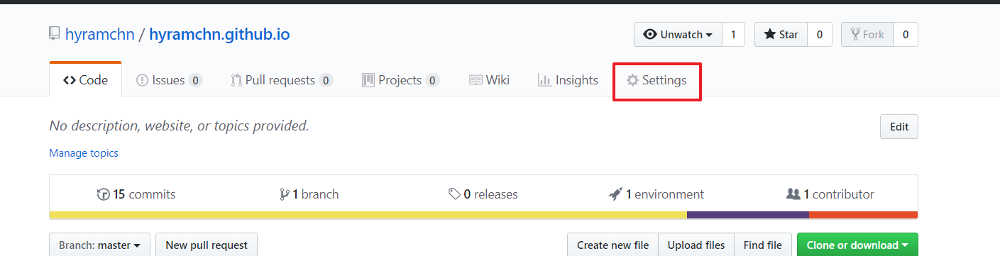
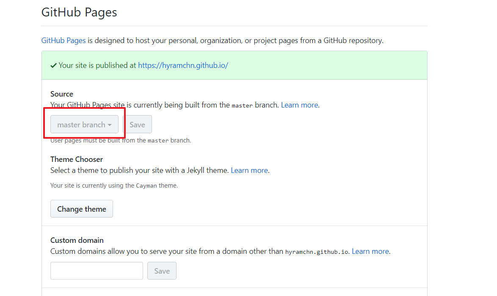
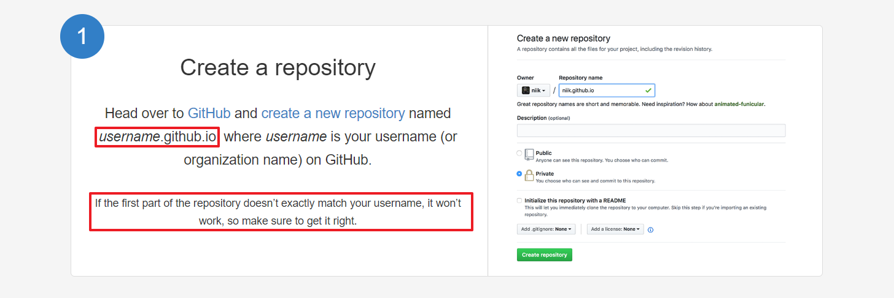
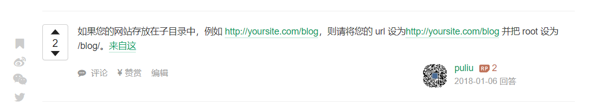

# 简单记录下本博客搭建过程

## 环境准备
### 注册[Github](https://github.com/features)账号

注册成功之后创建一个repository，本文章中设置Repository name为blog，创建成功后点击项目主页Settings按钮，如下图所示：

`<!-- more -->`表示点击阅读全文时的位置

下拉网页滚动条找到GitHub Pages,选择master branch，点击保存，即可启用Github Pages。

然后就可以看见GitHub Pages处显示你的GitPages网站连接，点击可以访问。

链接格式为：`https://<username>.github.io/<response name>`

接下来进行Git的安装和配置

### 安装[Git](https://git-scm.com/)

安装完成后，我们需要让本地Git与GitHub建立关联，需要配置SSH。随便找个目录，鼠标右键打开Git Bush，输入下面命令

> ssh-keygen -t rsa -C your_email@youremail.com  *此处邮箱地址要与你GitHub邮箱保持一致*

输入下面命令测试是否配置成功

> ssh -T git@github.com

控制台显示如下则表示连接成功

为了向GitHub提交代码，使用下列命令配置用户名与邮箱，邮箱可以与GitHub上的邮箱不相同。

> git config --global user.name "<your name>"
> git config --global user.email "<your email>"

### 安装[Node.js](http://nodejs.cn/)

下载Node.js并安装，完成之后在命令行中输入`node --version`，如果显示出版本号，表示安装成功

### 安装[Hexo](https://hexo.io/)博客框架

在命令行中输入下面命令安装hexo博客框架

> $ npm install -g hexo-cli

安装完成可以使用`hexo --version`查看相关信息

然后在资源管理器中创建一个目录作为博客的站点，执行下列命令创建站点

> hexo init <folder>
> cd <folder>
> npm install

配置[NexT](http://theme-next.iissnan.com/)主题

在命令行中使用下面命令下载`NexT`主题

> git clone `https://github.com/iissnan/hexo-theme-next` themes/next

然后在站点配置文件(博客根目录下`_config.yml`文件)中找到`them`字段，将其修改为`next`

> theme: next

然后在博客站点根目录执行下列命令生成博客

> hexo g
> hexo s

在浏览器中输入`http://localhost:4000`即可看到博客页面

<!-- more -->

## 配置 优化（待更新）

### 设置站点配置文件

    title: 网站标题
    subtitle: 网站副标题
    description: 网站描述
    author: 作者
    language: 网站使用的语言（zh-Hans）
    timezone: 时区（Asia/Shanghai）
    
    url: https://<GitHub的用户名>.github.io/<GitHub上你的博客response name>
    root: /<response neme]/
    
    deploy:
        type: git
        repo: git@github.com:<username>/<response name>
        branch: master

### 设置主题配置文件

    home: / || home
    archives: /archives || bars
    categories: /categories || th
    tags: /tags || tags
    about: /about || user

*'||'后面的名字为分类名称左边图标名字，采用[fontawesome](https://fontawesome.com/)网站的图标*

### 配置GitHub Pages

#### Settings

#### GitHub Pages 选择master

**不仔细导致的一个坑，项目名必须使用 `username.github.io`才能使用`https://<用户名>.github.io`访问。否则只能使用**

## hexo博客参考

1. [hexo博客图片问题](https://www.jianshu.com/p/c2ba9533088a)
2. [hexo-asset-image](https://github.com/CodeFalling/hexo-asset-image)
3. [样式图片url问题](https://segmentfault.com/q/1010000002924963)

因为css和js前面的url问题折腾了半天，最开始使用如下url本地正常，Github Pages上一致访问不到css和js文件

> url: `https://hyramchn.github.io/hyram`
> root: /hyram/

修改为如下格式后最终访问正常

> url: `https://hyramchn.github.io`
> root: /

4. [hexo博客的URL优化](https://zhangjiejun.com/posts/URL_optimization_in_hexo/)

## 备份source和部分配置文件到Github仓库

因为hexo deploy命令只会上传.deploy_git到Giuhub上，又不想再新建一个仓库来保存源代码和配置文件，查找谷歌最后使用如下方式备份。

1. 将hexo根目录初始化为一个git仓库，并添加remote连接到存放Github Pages项目的ssh连接，添加.gitignore文件
2. 将默认的master分支重名名为source分支（不知道是不是必须，开始没改名上传不上去），在Github上创建source分支，将本地推送到远程，这里命令没推成功，最后使用source tree推送上去的
3. 删除source分支里master分支的内容（博客站点代码）
4. 以后每写一次博客正常发布后将source分支同步到Github即可
5. 使用git clone url后发现source分支并没有克隆成功，使用git clone source url成功克隆了source分支